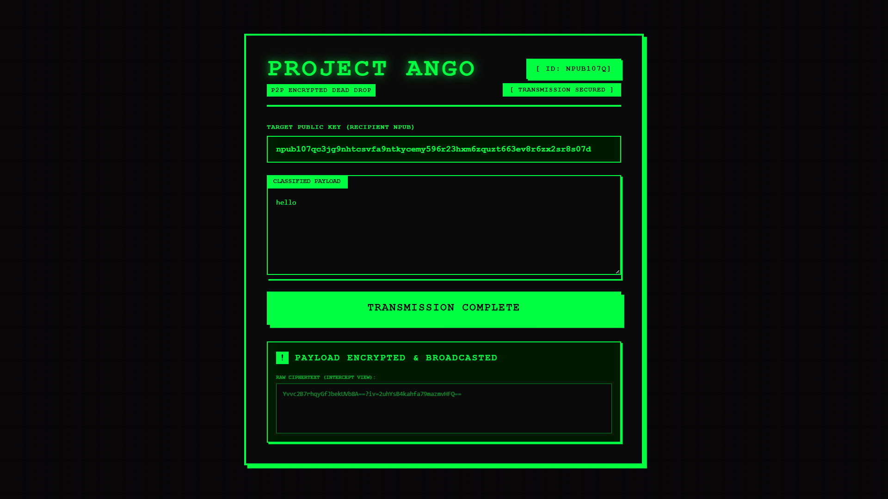

# 🤫 Project Ango | Cryptographic Dead Drop

Project Ango is a zero-build, client-side cryptographic terminal designed for secure, peer-to-peer communication on the Nostr protocol. It operates as a digital "Dead Drop," utilizing NIP-04 to mathematically lock payloads so that only the intended recipient can decrypt and read them.

## 📜 The Lore: What is "Ango"?

In Japanese, *Angō* (暗号) translates directly to "Cipher," "Code," or "Encryption." 

While previous tools in this suite (like Kioku and Muryo) focused on broadcasting and observing public data, Ango steps into the shadows. It is designed to facilitate absolute privacy on a public ledger. By using a Diffie-Hellman key exchange orchestrated through a user's browser wallet, Project Ango encrypts plaintext into an unreadable ciphertext. Even if a relay operator or a network spy intercepts the data packet, all they will see is cryptographic noise. Only the holder of the target private key can decipher the Angō.

## ✨ Core Features

* **NIP-04 Payload Encryption:** Leverages `window.nostr.nip04.encrypt()` to encrypt messages client-side before they ever touch the network or the relay infrastructure.
* **Zero-Knowledge Architecture:** Project Ango never asks for, sees, or stores your private keys. All cryptographic signing and encryption are delegated to the user's NIP-07 browser extension (e.g., Alby).
* **Targeted Kind 4 Events:** Automatically constructs and formats standard Nostr Direct Message events, ensuring the `["p", "<pubkey>"]` tag is perfectly injected so the recipient's client can locate the locked message.

## 🛠️ Tech Stack

Project Ango requires no backend, no database, and zero package managers.

* **Frontend:** HTML5, Tailwind CSS (via CDN) 
* **Architecture:** Vanilla JavaScript (ES6 Modules)
* **Protocol Toolkit:** `nostr-tools` v2 (Imported natively via `esm.sh`)

## 🚀 How to Run

1. Clone or download this repository.
2. Ensure you have a Nostr signer extension (like Alby) installed and unlocked.
3. Open `index.html` in any modern web browser.
4. Click **Connect Wallet** to establish a secure link with your identity.
5. Enter the `npub` (Public Key) of your intended recipient.
6. Type your classified payload.
7. Click **Encrypt & Transmit**. Approve the cipher request in your extension.
8. View the raw, intercepted ciphertext output on your screen to verify the encryption was successful before broadcast.

## 🧠 Architectural Concepts Mastered

1. **Diffie-Hellman Key Exchange:** Understanding how two parties can establish a shared secret over an insecure channel to encrypt messages.
2. **Ciphertext Visualization:** Demonstrating the separation between a user's plaintext input and the actual AES-256-CBC encrypted string (containing the `?iv=` initialization vector) broadcasted to the relays.
3. **Hexadecimal Routing:** Converting human-readable `npub` strings back into machine-readable Hex arrays to properly route encrypted packets across WebSocket connections.

---
*限界を越える - Surpass your limits.*