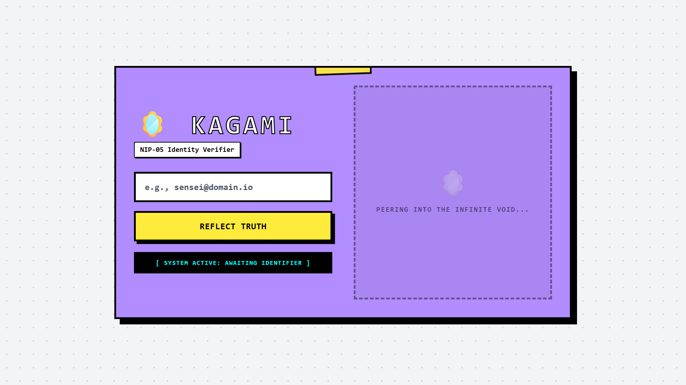
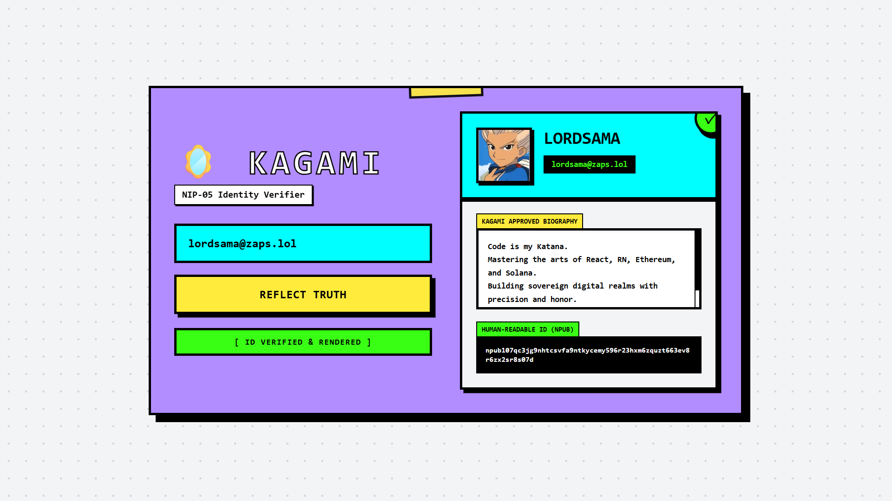

# 🪞 Project Kagami | Elegant NIP-05 Identity Verifier

Project Kagami is a zero-build, client-side dashboard designed to cryptographically verify Nostr identities. It bridges traditional Web2 DNS infrastructure with nostr decentralized relays to unmask impersonators and render a highly readable, cryptographically proven Identity Badge.

## 📜 The Lore: What is "Kagami"?

In Japanese mythology, the *Yata no Kagami* (八咫鏡) is the sacred Eight-Span Mirror of Truth. It represents wisdom and the ability to see things exactly as they are, stripping away illusions and deceit.

In the decentralized world of Nostr, anyone can generate a public key and claim to be anyone else. Project Kagami acts as the Mirror of Truth. By cross-referencing a user's claimed NIP-05 identifier (e.g., `user@domain.com`) with the actual cryptographic keys hosted on that domain's server, Kagami pierces through the illusion of fake profiles and only reflects mathematically verified identities.

## ✨ Core Features

* **Web2 to Web3 Bridging:** Automatically queries a domain's traditional `.well-known/nostr.json` file and maps it to decentralized relay metadata.
* **Human-Readable Cryptography:** Implements `nostr-tools/nip19` to convert raw, system-level Hex public keys into elegant, user-friendly `npub1...` strings on the fly.
* **Elegant Neubrutalism:** A highly responsive, split-pane dashboard utilizing harsh geometric grids, thick borders, and a vibrant, high-contrast color palette (Neo-Purple, Neo-Cyan, Neo-Yellow).
* **Multi-Relay Fallbacks:** Uses `SimplePool` to aggressively fetch metadata across the ecosystem's most reliable profile relays (PurplePag.es, Damus, Nos.lol).

## 🛠️ Tech Stack

Project Kagami requires zero package managers or build steps. It is designed to be lightweight and instantly deployable as a portfolio widget.

* **Structure:** HTML5 
* **Styling:** Tailwind CSS (via CDN) 
* **Logic:** Vanilla JavaScript (ES6 Modules)
* **Protocol Engine:** `nostr-tools` 

## 🚀 How to Run

1. Clone or download this repository.
2. Ensure `index.html` and `app.js` are in the same directory.
3. Double-click `index.html` to open it in any modern web browser.
4. Enter a known NIP-05 identifier (e.g., `jb55@jb55.com` or `fiatjaf@fiatjaf.com`) and click **Reflect Truth**.

---
*限界を越える - Surpass your limits.*