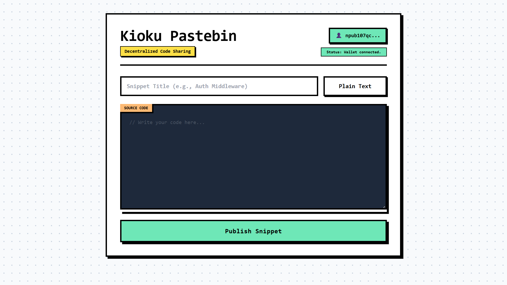
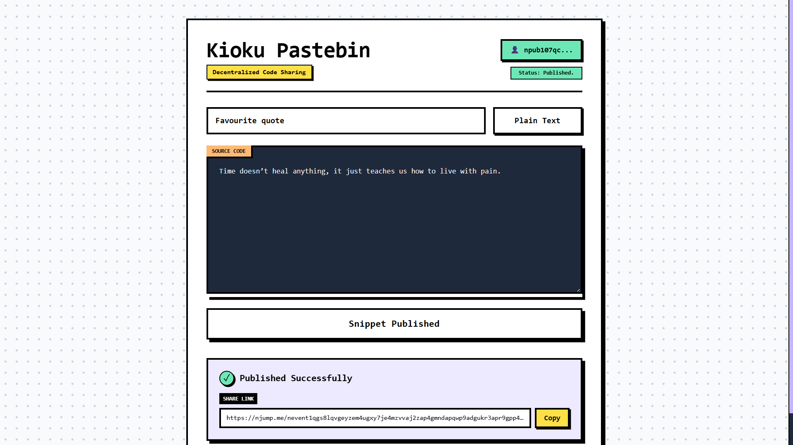

# 📜 Project Kioku | Decentralized Pastebin

Project Kioku is a decentralized, identity-linked "Pastebin" built on the Nostr protocol. It empowers developers to etch code snippets and plain text directly into a global, censorship-resistant ledger. By leveraging NIP-07 browser extensions, users can cryptographically sign their payloads, proving ownership while bypassing traditional centralized hosting servers.

## 📜 The Lore: What is "Kioku"?

In Japanese, *Kioku* (記憶) translates directly to "Memory" or "Record." 

Traditional code-sharing platforms (like GitHub Gists or Pastebin) rely on centralized databases. If the server goes down or the company changes its policies, the memory is lost. Project Kioku ensures absolute memory preservation. By cryptographically signing your text payloads and distributing them across independent global relays, the record cannot be deleted, altered, or silenced. It is etched into the protocol forever.

## ✨ Core Features

* **NIP-07 Wallet Integration:** Connects seamlessly with browser extensions like Alby or nos2x. The app never touches the user's private keys; it simply requests a cryptographic signature for the payload, ensuring maximum security and true identity ownership.
* **Complex Metadata Tagging:** Implements NIP-94 style metadata tags (e.g., `["m", "application/javascript"]`, `["title", "Snippet Name"]`) directly onto standard events for pristine decentralized indexing and searchability.
* **NIP-19 Encoding:** Automatically translates the raw Event ID into a globally recognizable `nevent` string, instantly generating a shareable `njump.me` link compatible with any modern Nostr client.

## 🛠️ Tech Stack

Project Kioku requires zero package managers or build steps, designed to be instantly deployable.

* **Frontend:** HTML5, Tailwind CSS (CDN) with Custom Neubrutalism Config
* **Architecture:** Vanilla JavaScript (ES6 Modules)
* **Protocol Toolkit:** `nostr-tools` v2 (Imported natively via `esm.sh`)

## 🚀 How to Run

1. Clone or download this repository.
2. Ensure you have a Nostr signer extension (like Alby) installed in your browser.
3. Open `index.html` in your web browser.
4. Click **Connect Wallet** to authenticate your decentralized identity.
5. Select a syntax language, write your code, and click **Publish Snippet**.
6. Approve the signature prompt from your extension.
7. Copy the generated share link to distribute your permanent snippet globally.

---
*限界を越える - Surpass your limits.*