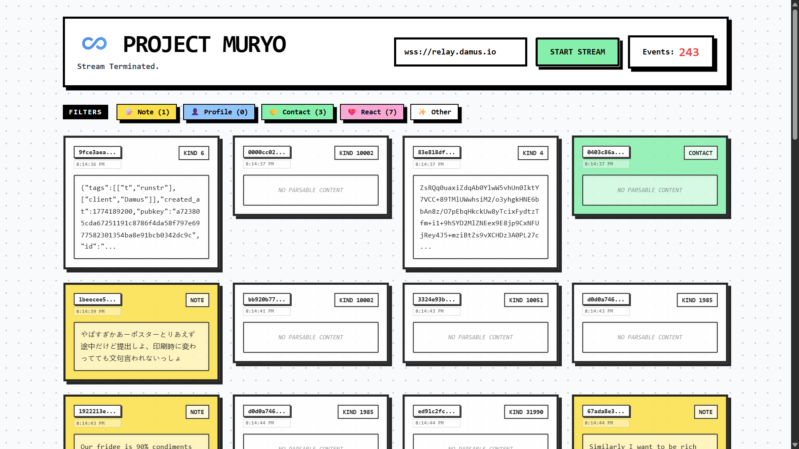

# ♾️ Project Muryo | Nostr Relay Firehose

Welcome to Project Muryo. 

This project is a high-performance data visualizer built to tap directly into the "Dragon Veins" of the Nostr protocol (Relays). It allows users to dynamically connect to any global relay and stream the raw, unfiltered heartbeat of decentralized communication in real-time.

## 📜 The Lore: What is "Muryo"?

In eastern concepts, *Muryō* (無量) translates to the Infinite or the Unlimited. It represents a domain—an *Infinite Void*—where one is flooded with an endless, overwhelming stream of raw information and phenomena all at once. 

Subscribing to a major Nostr relay with an empty filter `[{}]` does exactly this: it blasts your client with the infinite void of the network. Project Muryo was built to observe, filter, and survive this chaotic data stream without crashing the browser.

## ✨ Core Features

* **Dynamic Relay Targeting:** Input any valid WebSocket URL (e.g., `wss://relay.damus.io`, `wss://nos.lol`) to instantly switch the stream's origin.
* **Real-Time Client-Side Filtering:** Interactive legend buttons allow users to mute specific event kinds (Notes, Profiles, Reactions) on the fly without dropping the WebSocket connection.
* **Neubrutalist UI:** Styled with high-contrast, harsh borders, and bold colors inspired by modern 2026 Web3 design trends.
* **DOM Memory Management:** Implements a strict garbage collection queue (`MAX_EVENTS_ON_SCREEN = 40`) to ensure the browser never runs out of memory, no matter how fast the firehose flows.
* **Automated Cryptographic Parsing:** Converts UNIX timestamps and truncates `ed25519` public keys for a clean, human-readable masonry layout.

## 🛠️ Tech Stack

Project Muryo is built for extreme lightweight performance, utilizing zero local build steps.

* **Structure:** HTML5
* **Styling:** Tailwind CSS (via CDN) with custom Neubrutalist configuration
* **Logic:** Vanilla JavaScript (ES6 Modules)
* **Protocol Engine:** `nostr-tools` (Imported natively via `esm.sh` CDN)

## 🚀 How to Run

Because Project Muryo relies entirely on native browser features and ES Module CDNs, there is no massive `node_modules` folder or build step required.

1. Clone or download this repository.
2. Ensure `index.html` and `app.js` are in the same directory.
3. Double-click `index.html` to open it in any modern web browser (Chrome, Brave, Edge).
4. Enter a target relay (defaults to `wss://relay.damus.io`) and click **Start Stream**.
5. *Warning: High traffic relays will populate the grid violently fast.*

---
*限界を越える - Surpass your limits.*