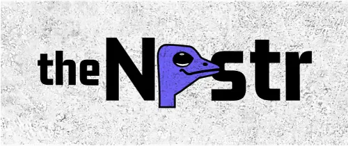

# 🦩 nostr-sama

  
  
<em>"Notes and Other Stuff Transmitted by Relays"</em>

  
<strong>A progressive learning journey into the decentralized web.</strong>

## 🚀 Overview
**nostr-sama** is a centralized lab for decentralized experiments. This repository serves as a workspace for learning the [Nostr protocol](https://github.com/nostr-protocol/nostr), implementing various [NIPs](https://github.com/nostr-protocol/nips), and building modular applications that leverage event-driven relay architectures.

## 🛠 Tech Stack 
- **Language**: TypeScript / Rust (Nostr-SDK)
- **Relays**: Integration with `wss://relay.damus.io` and private local relays
- **Security**: Schnorr signatures and bech32 encoding ([NIP-19](https://github.com))

