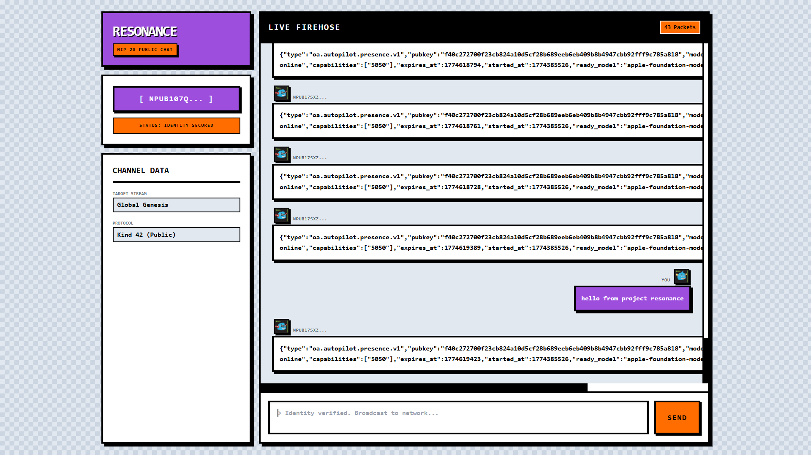

# ⚡ Project Resonance | Global NIP-28 Communication Layer

Project Resonance is a real-time, decentralized communication interface built entirely on the Nostr protocol. It operates without any centralized servers, acting as a direct "thick client" to global WebSocket relays to stream and broadcast NIP-28 (Public Chat) packets at lightning speed.

## 📜 The Concept: What is "Resonance"?

In physics, resonance occurs when a system vibrates at specific frequencies, allowing energy to transfer flawlessly across a medium. 

In today's world, relying on centralized servers for communication introduces critical points of failure, censorship risks, and latency. Project Resonance acts as the decentralized frequency. It connects directly to the global relay network to pull live NIP-28 chat firehoses. By delegating cryptographic signing to the user's NIP-07 browser extension (like Alby), Resonance allows users to broadcast public chat messages globally while retaining absolute ownership of their cryptographic identity.

## ✨ Core Features & UX Engineering

* **Stream Deduplication:** High-traffic global firehoses often result in duplicate packets from different relays. Resonance utilizes a JavaScript `Set()` memory architecture to track event IDs, ensuring perfect, deduplicated rendering.
* **Identity Delegation (NIP-07):** Flawless wallet integration. Users can stream the chat anonymously, but must provide cryptographic proof of identity to broadcast.
* **Algorithmic Avatars:** Dynamically parses incoming public keys (`npub`) to generate unique, deterministic robotic avatars via RoboHash, preventing the need to fetch heavy `Kind 0` metadata profiles for every message.

## 🛠️ Tech Stack

Built for maximum speed and zero local build steps.

* **Frontend:** HTML5, Tailwind CSS (via CDN)
* **Architecture:** Vanilla JavaScript (ES6 Modules)
* **Protocol Toolkit:** `nostr-tools` v2 (Imported natively via `esm.sh`)

## 🚀 How to Run

1. Clone or download this repository.
2. Ensure you have a Nostr signer extension (like Alby) installed in your browser.
3. Open `index.html`. The client will instantly establish a WebSocket uplink and stream live network packets.
4. Click **Connect Wallet** to authenticate your identity.
5. Type a message in the terminal and broadcast it to the global network in real-time.

---
*限界を越える - Surpass your limits.*