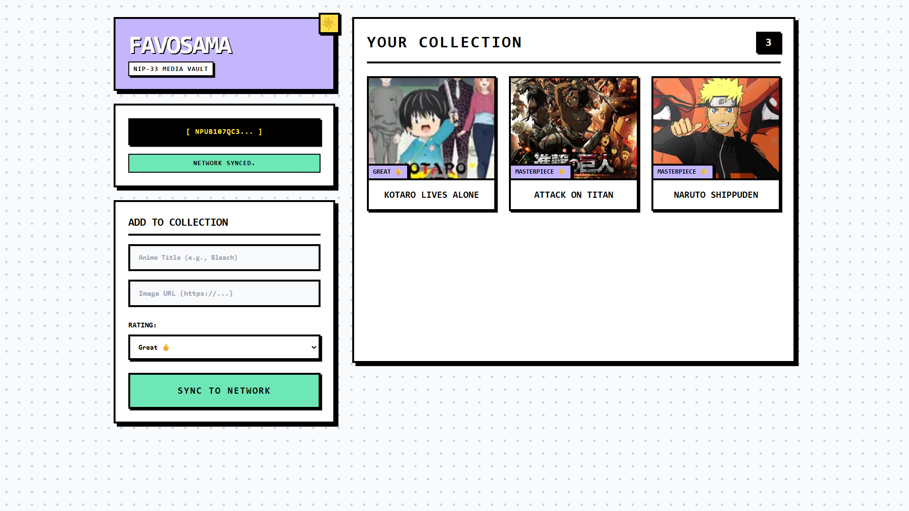

# 🌟 FavoSama | Immutable Media Vault

FavoSama is a completely decentralized, serverless application for tracking and rating your favorite anime and media. It utilizes the Nostr protocol to provide a gasless, globally synced database that is permanently tied to your cryptographic identity.

## 📜 The Concept

Traditional dApps often require users to pay gas fees for every state change (like adding a new item to a list). Traditional Web2 apps require centralized servers and databases (like MongoDB) that can be shut down or heavily censored.

FavoSama leverages Nostr's **Parameterized Replaceable Events (NIP-33)** to solve both problems. When you add a new series to your vault, FavoSama packages your entire collection into a single cryptographic payload and broadcasts it to global relays. The relays automatically overwrite your old vault with the new one. The result is a lightning-fast, zero-cost, permanent personal database.

## ✨ Core Features

* **Serverless State Management (NIP-33):** Acts as a decentralized CRUD application. Uses `kind: 30000` events to maintain a persistent, globally accessible state without a backend.
* **Wallet Delegation (NIP-07):** Seamlessly connects with browser extensions (like Alby) to sign data payloads. Your private keys never touch the DOM.
* **Safe Relay Broadcasting:** Implements a robust `Promise.all` publishing architecture to ensure data is successfully mirrored across multiple independent relays (`damus`, `nos.lol`, `primal`) without crashing.

## 🛠️ Tech Stack

FavoSama is built for extreme lightweight performance with zero local build steps.

* **Frontend Structure:** HTML5
* **Styling:** Tailwind CSS (via CDN) with Custom Neubrutalist Configuration
* **Logic & Protocol:** Vanilla JavaScript (ES6 Modules) utilizing `nostr-tools` v2 (via `esm.sh`)

## 🚀 How to Run

1. Clone or download this repository.
2. Ensure you have a Nostr signer extension (like Alby) installed in your browser.
3. Open `index.html` in any modern web browser.
4. Click **Connect Identity** to authenticate and automatically fetch your existing vault from the network.
5. Fill out the "Add to Collection" form with a title, image URL, and rating.
6. Click **Sync to Network** and approve the signature request to permanently etch your updated vault into the protocol.

*限界を越える - Surpass your limits.*